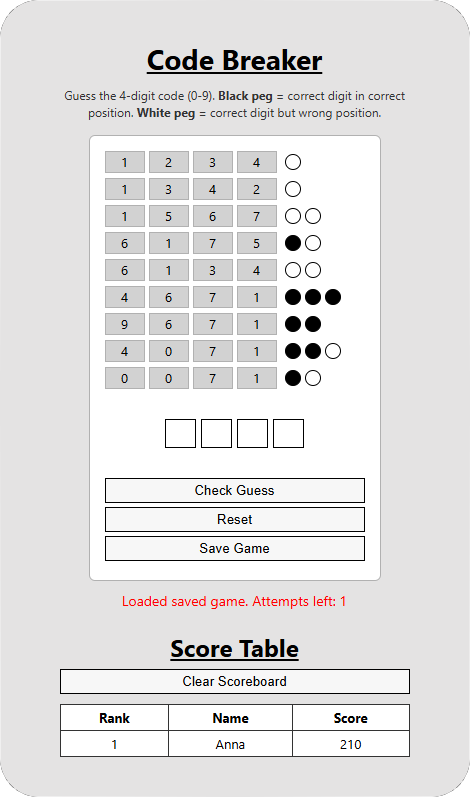

# Code Breaker Game
Code Breaker is a 4-digit Mastermind-style puzzle. You have up to 10 attempts to guess a secret code composed of digits 0–9.

[PLAY HERE](https://megaphy.github.io/Code-Breaker/CodeBreaker.html)



## Instructions

The game is composed of the followiing files:
- `CodeBreaker.html:` Game UI
- `style.css:` Styles for the board and pegs
- `logic.js:` Game logic, and DOM updates (Javascript)<br>
To play you can either download all the files to your computer and open `CodeBreaker.html` which will run the game on your browser or simply use the link at the top for the GitHub hosted version. This game uses LocalStorage.

## Rules
The pegs don't appear in the same order as your guessed digits. Instead, they show you how many digits you got right overall, without telling you which positions are correct.
- `Black peg:` A digit is correct and in the correct position.
- `White peg:` A digit is in the secret code but in the wrong position.
- `No peg:` A digit does not appear in the secret code.

## Gameplay

- Enter your name for the scoreboard before playing.
- Enter four digits in the input boxes and press `Check Guess`.
- Review the guess history: past guesses appear on the left; peg feedback appears to the right.
- The game ends when you get 4 black pegs (win) or after 10 attempts (loss).

## Controls

- `Check Guess:` Evaluates your current 4-digit guess and shows peg feedback.
- `Reset:` Starts a brand-new game with a new secret code and clears history.
- `Save Game:` Manually saves your current game state to local storage. Make sure you do this before reloading the page or closing it, otherwise you will lose progress. The only thing that's saved automatically is your score when you end a game.
- `Clear Scoreboard:` I decided to add this in case I only want a scoreboard for a specific set of tries. Click to reset the scoreboard.

## How Scoring Works
Scores are based on the sequential correct digits in each guess, which award one point each. Since that's a small number, multiplying by a 100 will give a larger, more satisfying number.<br>Scores are calculated when the game ends (either by winning or running out of attempts) using this formula:
```
Score = (maxSequential × 100) - ((attempts - 1) × 10)
```
- `Sequential Bonus (maxSequential × 100)`<br>
Tracks the maximum number of consecutive correct digits from the start, across all guesses.<br>
<b>Example</b>: If the code is [1,2,3,4] and I guess [1,2,5,6], I will get 2 sequential points.
This value is tracked throughout the game and keeps the highest count, multiplied by 100 for the base score. 
- `Attempt Penalty ((attempts - 1) × 10)`<br>
Each attempt beyond the first reduces your score by 10 points. Fewer attempts will grant a higher score. The first attempt has no penalty.

That means, for example, if I win, my score will be 4 x 100 - (how many attempts it took me to solve - 1 (since first guess doesn't count as a penalty)) * 10.


